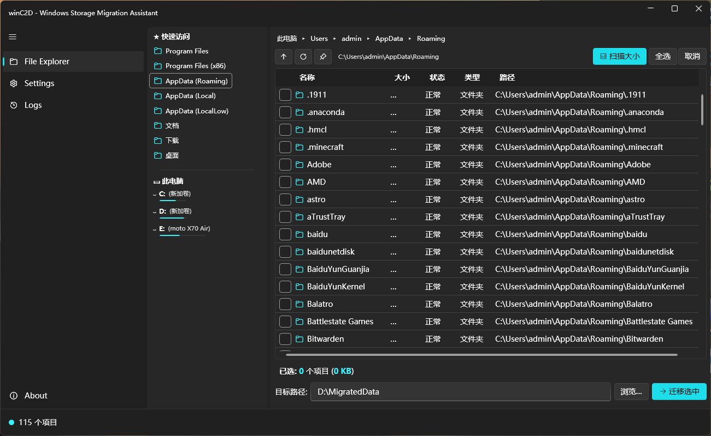

# winC2D -- Windows Storage Migration Assistant

[简体中文](docs/README.zh-CN.md) · [繁體中文](docs/README.zh-Hant.md) · [日本語](docs/README.ja.md) · [한국어](docs/README.ko.md) · [Русский](docs/README.ru.md) · [Português (Brasil)](docs/README.pt-BR.md)

---

## About

winC2D is a Windows disk migration assistant that moves installed applications and folders from your C drive to another disk using standard Windows **symbolic links** and file-copy operations. No modification to application binaries or registry entries is required.

## Features

- **Unified file browser** -- navigate drives in an Explorer-like interface with breadcrumb navigation and quick-access sidebar
- **Size scanning** -- calculate directory sizes with cache support for fast subsequent scans
- **Symbolic link migration** -- move folders to another drive, then create a symlink at the original path so everything keeps working
- **Rollback support** -- full migration history with one-click rollback for completed tasks
- **7 languages** -- English, 简体中文, 繁體中文, 日本語, 한국어, Русский, Português (Brasil)
- **Dark / Light theme** -- follows system preference, manually switchable
- **Auto-elevation** -- requests administrator privileges on launch (required for symlink creation and Program Files access)
- **Agent-ready** -- ships with a machine-readable CLI for AI agents and scripts; see [README.ai.md](docs/README.ai.md)

## Tech Stack

- C# · .NET 8.0 · WPF
- [WPF-UI](https://github.com/lepoco/wpfui) (Fluent Design)
- CommunityToolkit.Mvvm · Microsoft.Extensions.DependencyInjection

## Download

1. Download `winC2D-Setup.exe` from [Releases](https://github.com/Aknirex/winC2D/releases)
2. Run the installer -- defaults to `D:\Program Files\winC2D` (not C drive)
3. The installer bundles the GUI, CLI, gsudo elevation utility, and can link one shared AI agent skill into Codex, Claude Code, Antigravity, OpenCode, OpenClaw, and other common agents
4. Administrator privileges are required for migration (the app auto-elevates)
5. Uninstall via Control Panel -> Programs and Features
6. Requires Windows 10 / 11

## How It Works

1. **Scan** -- browse to a folder and click "Scan Sizes" to measure directory sizes
2. **Select** -- check the folders you want to migrate
3. **Migrate** -- winC2D copies the folder to the target drive, then replaces the original path with a symbolic link pointing to the new location
4. **Rollback** -- from the Logs page, select a completed task and click Rollback to restore the original state

## Contributing

Pull requests are welcome. For major changes, please open an issue first.

## License

[MIT](LICENSE)
