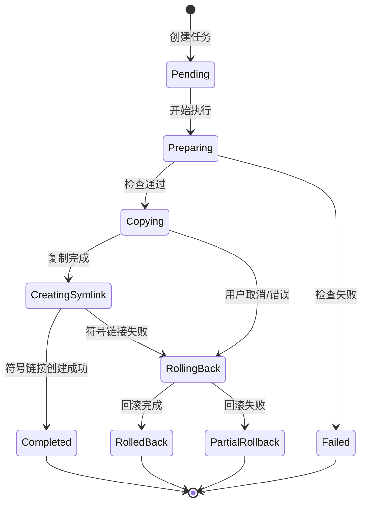
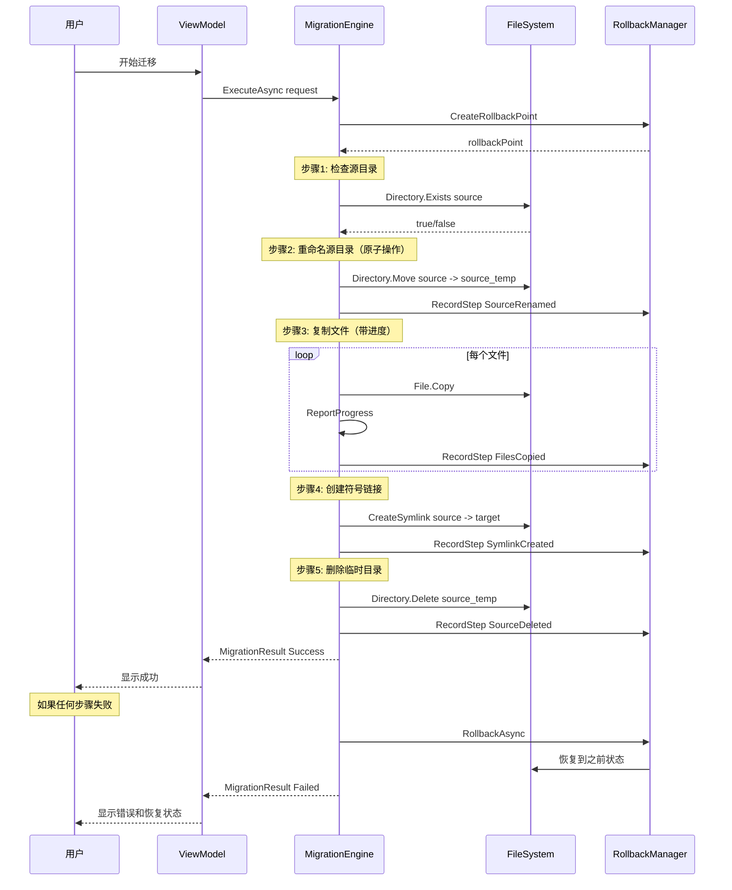

# winC2D Refactoring Design Document

## 一、现有代码问题分析

### 1.1 迁移逻辑问题

| 问题 | 现状 | 影响 |
|------|------|------|
| **同步阻塞** | [`SoftwareMigrator.MigrateSoftware()`](SoftwareMigrator.cs:10) 是同步方法 | 大文件迁移时 UI 卡顿 |
| **无进度报告** | 复制过程无回调机制 | 用户无法了解进度 |
| **错误处理粗糙** | 异常直接抛出，无详细错误分类 | 用户难以理解失败原因 |
| **回滚不完整** | [`RollbackSoftware()`](SoftwareMigrator.cs:134) 仅处理目录，不处理符号链接失败场景 | 可能留下残留状态 |

### 1.2 架构问题

```
当前架构（问题）:
┌─────────────────────────────────────────┐
│              MainForm.cs               │
│  (UI + 业务逻辑 + 异步处理 混在一起)      │
├─────────────────────────────────────────┤
│  SoftwareScanner.cs  │  AppDataMigrator │
│  SoftwareMigrator.cs │  MigrationLogger │
└─────────────────────────────────────────┘
```

- **UI 与业务耦合**：MainForm.cs 1316 行，包含扫描、迁移、UI 更新逻辑
- **无 MVVM 模式**：WinForms 事件驱动，难以测试和维护
- **状态管理混乱**：迁移状态分散在多个地方

### 1.3 性能问题

| 问题点 | 代码位置 | 说明 |
|--------|----------|------|
| 目录大小计算慢 | [`SoftwareScanner.GetDirectorySizeUntil()`](SoftwareScanner.cs:122) | 递归遍历，大目录耗时 |
| 扫描阻塞 UI | [`LoadInstalledSoftwareSafe()`](MainForm.cs:193) | Task.Run 但无取消机制 |
| 复制无并行 | [`CopyDirectoryAllOrFail()`](SoftwareMigrator.cs:76) | 单线程复制 |

---

## 二、新架构设计

### 2.1 技术栈

| 组件 | 选择 | 理由 |
|------|------|------|
| **UI 框架** | WPF + WPF-UI | Fluent Design，MVVM 支持 |
| **.NET 版本** | .NET 8.0 | 与现有项目一致 |
| **MVVM 框架** | CommunityToolkit.Mvvm | 微软官方，轻量级 |
| **依赖注入** | Microsoft.Extensions.DependencyInjection | 解耦组件 |
| **日志** | Microsoft.Extensions.Logging + Serilog | 结构化日志 |

### 2.2 项目结构

```
winC2D/
├── winC2D.Core/                    # 核心业务逻辑（无 UI 依赖）
│   ├── Models/                     # 数据模型
│   │   ├── MigrationTask.cs        # 迁移任务
│   │   ├── MigrationResult.cs      # 迁移结果
│   │   ├── SoftwareInfo.cs         # 软件信息
│   │   └── RollbackPoint.cs        # 回滚点
│   ├── Services/                   # 核心服务
│   │   ├── IMigrationEngine.cs     # 迁移引擎接口
│   │   ├── MigrationEngine.cs      # 迁移引擎实现
│   │   ├── ISoftwareScanner.cs     # 软件扫描接口
│   │   ├── SoftwareScanner.cs      # 软件扫描实现
│   │   ├── ISymlinkManager.cs      # 符号链接管理
│   │   ├── SymlinkManager.cs       # 符号链接实现
│   │   ├── IRollbackManager.cs     # 回滚管理接口
│   │   └── RollbackManager.cs       # 回滚管理实现
│   ├── FileSystem/                 # 文件系统操作
│   │   ├── IFileSystem.cs          # 文件系统接口（便于测试）
│   │   ├── FileSystem.cs           # 真实实现
│   │   └── MockFileSystem.cs       # 测试用模拟
│   └── Events/                     # 事件定义
│       ├── MigrationProgressEventArgs.cs
│       └── MigrationErrorEventArgs.cs
│
├── winC2D.Infrastructure/           # 基础设施
│   ├── Logging/                    # 日志配置
│   ├── Configuration/              # 配置管理
│   └── Localization/               # 多语言支持
│
├── winC2D.App/                     # WPF 应用
│   ├── App.xaml                    # 应用入口
│   ├── App.xaml.cs
│   ├── Views/                      # 视图（XAML）
│   │   ├── MainWindow.xaml         # 主窗口
│   │   ├── Views/                  # 子视图
│   │   │   ├── SoftwareMigrationView.xaml
│   │   │   ├── AppDataMigrationView.xaml
│   │   │   ├── SettingsView.xaml
│   │   │   └── LogView.xaml
│   │   └── Dialogs/                # 对话框
│   │       ├── MigrationProgressDialog.xaml
│   │       └── RollbackDialog.xaml
│   ├── ViewModels/                 # 视图模型
│   │   ├── MainViewModel.cs
│   │   ├── SoftwareMigrationViewModel.cs
│   │   ├── AppDataMigrationViewModel.cs
│   │   └── SettingsViewModel.cs
│   ├── Controls/                   # 自定义控件
│   │   └── ProgressRing.xaml
│   ├── Converters/                 # 值转换器
│   │   ├── SizeToStringConverter.cs
│   │   └── StatusToColorConverter.cs
│   └── Themes/                     # 主题资源
│       └── FluentTheme.xaml
│
└── winC2D.Tests/                   # 单元测试
    ├── Core/
    └── Integration/
```

### 2.3 核心类设计

#### 2.3.1 迁移引擎接口

```csharp
public interface IMigrationEngine
{
    /// <summary>迁移进度事件</summary>
    event EventHandler<MigrationProgressEventArgs> ProgressChanged;
    
    /// <summary>迁移错误事件</summary>
    event EventHandler<MigrationErrorEventArgs> ErrorOccurred;
    
    /// <summary>创建迁移任务</summary>
    Task<MigrationTask> CreateTaskAsync(MigrationRequest request, CancellationToken ct = default);
    
    /// <summary>执行迁移</summary>
    Task<MigrationResult> ExecuteAsync(MigrationTask task, CancellationToken ct = default);
    
    /// <summary>暂停迁移</summary>
    Task PauseAsync(string taskId);
    
    /// <summary>恢复迁移</summary>
    Task ResumeAsync(string taskId);
    
    /// <summary>取消迁移</summary>
    Task CancelAsync(string taskId);
}
```

#### 2.3.2 迁移任务状态机



#### 2.3.3 回滚点设计

```csharp
public class RollbackPoint
{
    public string Id { get; set; } = Guid.NewGuid().ToString();
    public DateTime CreatedAt { get; set; } = DateTime.UtcNow;
    public string TaskId { get; set; }
    
    /// <summary>迁移类型</summary>
    public MigrationType Type { get; set; }
    
    /// <summary>原始路径</summary>
    public string SourcePath { get; set; }
    
    /// <summary>目标路径</summary>
    public string TargetPath { get; set; }
    
    /// <summary>临时备份路径（重命名后的源目录）</summary>
    public string? BackupPath { get; set; }
    
    /// <summary>已完成的步骤</summary>
    public List<CompletedStep> CompletedSteps { get; set; } = new();
    
    /// <summary>是否可回滚</summary>
    public bool CanRollback => CompletedSteps.Count > 0;
}

public enum CompletedStep
{
    SourceRenamed,      // 源目录已重命名
    FilesCopied,        // 文件已复制
    SymlinkCreated,     // 符号链接已创建
    SourceDeleted       // 源目录已删除
}
```

### 2.4 迁移流程改进

#### 新的迁移流程（原子性保证）



### 2.5 性能优化设计

#### 2.5.1 并行复制策略

```csharp
public class ParallelCopyOptions
{
    /// <summary>最大并行度</summary>
    public int MaxDegreeOfParallelism { get; set; } = Environment.ProcessorCount;
    
    /// <summary>大文件阈值（超过此值使用流式复制）</summary>
    public long LargeFileThreshold { get; set; } = 100 * 1024 * 1024; // 100MB
    
    /// <summary>缓冲区大小</summary>
    public int BufferSize { get; set; } = 1024 * 1024; // 1MB
    
    /// <summary>进度报告间隔（毫秒）</summary>
    public int ProgressReportInterval { get; set; } = 100;
}
```

#### 2.5.2 扫描优化

```csharp
public class ScanOptions
{
    /// <summary>使用缓存</summary>
    public bool UseCache { get; set; } = true;
    
    /// <summary>缓存有效期</summary>
    public TimeSpan CacheExpiration { get; set; } = TimeSpan.FromMinutes(5);
    
    /// <summary>并行扫描目录</summary>
    public bool ParallelScan { get; set; } = true;
    
    /// <summary>跳过大小计算（仅列出）</summary>
    public bool SkipSizeCalculation { get; set; } = false;
    
    /// <summary>大小计算阈值（超过则异步计算）</summary>
    public long AsyncSizeThreshold { get; set; } = 100 * 1024 * 1024; // 100MB
}
```

---

## 三、WPF-UI 界面设计

### 3.1 主窗口布局

```xml
<!-- MainWindow.xaml 结构示意 -->
<wpfui:FluentWindow>
    <wpfui:FluentWindow.TitleBar>
        <!-- 自定义标题栏 -->
    </wpfui:FluentWindow.TitleBar>
    
    <Grid>
        <Grid.RowDefinitions>
            <RowDefinition Height="Auto"/> <!-- 导航 -->
            <RowDefinition Height="*"/>    <!-- 内容 -->
            <RowDefinition Height="Auto"/> <!-- 状态栏 -->
        </Grid.RowDefinitions>
        
        <!-- 导航栏 -->
        <wpfui:NavigationStack Grid.Row="1">
            <wpfui:NavigationItem Icon="Software" Content="软件迁移"/>
            <wpfui:NavigationItem Icon="Folder" Content="AppData"/>
            <wpfui:NavigationItem Icon="Settings" Content="系统设置"/>
            <wpfui:NavigationItem Icon="History" Content="日志"/>
        </wpfui:NavigationStack>
        
        <!-- 内容区域 -->
        <Frame Grid.Row="1" Source="{Binding CurrentView}"/>
        
        <!-- 状态栏 -->
        <StatusBar Grid.Row="2">
            <TextBlock Text="{Binding StatusMessage}"/>
        </StatusBar>
    </Grid>
</wpfui:FluentWindow>
```

### 3.2 软件迁移视图

```
┌─────────────────────────────────────────────────────────────────┐
│  📦 软件迁移                                    [刷新] [扫描路径]  │
├─────────────────────────────────────────────────────────────────┤
│  ┌─────────────────────────────────────────────────────────┐   │
│  │ 🔍 搜索软件...                                          │   │
│  └─────────────────────────────────────────────────────────┘   │
│                                                                 │
│  ┌─────┬──────────────────┬──────────────┬──────────┬────────┐ │
│  │ ☑  │ 名称             │ 路径         │ 大小     │ 状态   │ │
│  ├─────┼──────────────────┼──────────────┼──────────┼────────┤ │
│  │ ☑  │ Google Chrome    │ C:\Program...│ 856 MB   │ ✓ 正常 │ │
│  │ ☐  │ Visual Studio    │ C:\Program...│ 2.3 GB   │ ⚠ 可疑 │ │
│  │ ☑  │ WeChat           │ C:\Program...│ 234 MB   │ ✓ 正常 │ │
│  │ ☐  │ Microsoft Edge   │ C:\Program...│ 1.2 GB   │ 🔗 已迁移│ │
│  └─────┴──────────────────┴──────────────┴──────────┴────────┘ │
│                                                                 │
│  已选择: 2 项 (共 1.1 GB)                                       │
│                                                                 │
│  目标磁盘: [D: ▼]  路径: D:\MigratedApps                       │
│                                                                 │
│  ┌─────────────────────────────────────────────────────────┐   │
│  │              [迁移选中项]    [取消]                      │   │
│  └─────────────────────────────────────────────────────────┘   │
└─────────────────────────────────────────────────────────────────┘
```

### 3.3 迁移进度对话框

```
┌─────────────────────────────────────────────────────────────────┐
│  ⏳ 正在迁移...                                    [最小化] [×]  │
├─────────────────────────────────────────────────────────────────┤
│                                                                 │
│  正在迁移: Google Chrome                                        │
│  当前步骤: 复制文件 (3/5)                                       │
│                                                                 │
│  ┌─────────────────────────────────────────────────────────┐   │
│  │████████████████████░░░░░░░░░░░░░░░░░░░░░░░░░░░░░░░░░░░░│   │
│  └─────────────────────────────────────────────────────────┘   │
│  45%  (385 MB / 856 MB)                                        │
│                                                                 │
│  已用时间: 00:02:34    预计剩余: 00:03:12                       │
│                                                                 │
│  ┌─────────────────────────────────────────────────────────┐   │
│  │              [暂停]    [取消并回滚]                      │   │
│  └─────────────────────────────────────────────────────────┘   │
└─────────────────────────────────────────────────────────────────┘
```

### 3.4 回滚管理界面

```
┌─────────────────────────────────────────────────────────────────┐
│  📜 迁移历史与回滚                                              │
├─────────────────────────────────────────────────────────────────┤
│  ┌──────────┬──────────────┬──────────────┬────────┬──────────┐ │
│  │ 时间     │ 软件         │ 原路径       │ 新路径 │ 状态     │ │
│  ├──────────┼──────────────┼──────────────┼────────┼──────────┤ │
│  │ 10:30   │ Chrome       │ C:\Program...│ D:\... │ ✓ 成功   │ │
│  │ 10:25   │ WeChat      │ C:\Program...│ D:\... │ ⚠ 已回滚 │ │
│  │ 昨天    │ VSCode      │ C:\Program...│ D:\... │ ✓ 成功   │ │
│  └──────────┴──────────────┴──────────────┴────────┴──────────┘ │
│                                                                 │
│  选中项详情:                                                    │
│  ┌─────────────────────────────────────────────────────────┐   │
│  │ 软件: WeChat                                            │   │
│  │ 原路径: C:\Program Files\Tencent\WeChat                  │   │
│  │ 新路径: D:\MigratedApps\WeChat                           │   │
│  │ 状态: 已回滚 (用户取消)                                  │   │
│  │ 回滚时间: 2024-03-09 10:26:34                           │   │
│  └─────────────────────────────────────────────────────────────────┘   │
│                                                                 │
│  [回滚选中项]    [导出日志]    [清空历史]                        │
└─────────────────────────────────────────────────────────────────┘
```

---

## 四、实施计划

### 阶段一：项目基础搭建

| 任务 | 说明 |
|------|------|
| 创建解决方案结构 | 新建 winC2D.Core、winC2D.Infrastructure、winC2D.App 项目 |
| 配置 WPF-UI | 安装 WPF-UI NuGet 包，配置主题 |
| 配置依赖注入 | 设置 ServiceCollection 和 MainWindow |
| 配置日志系统 | Serilog 配置，文件 + 控制台输出 |
| 迁移多语言系统 | 从 .resx 迁移到新的本地化系统 |

### 阶段二：核心业务逻辑

| 任务 | 说明 |
|------|------|
| 实现 Models | MigrationTask、MigrationResult、SoftwareInfo、RollbackPoint |
| 实现 IFileSystem | 文件系统抽象接口 |
| 实现 ISymlinkManager | 符号链接管理 |
| 实现 IMigrationEngine | 迁移引擎核心逻辑 |
| 实现 IRollbackManager | 回滚管理器 |
| 实现 ISoftwareScanner | 软件扫描服务 |
| 单元测试 | 核心逻辑测试 |

### 阶段三：UI 实现

| 任务 | 说明 |
|------|------|
| MainWindow | 主窗口框架、导航 |
| SoftwareMigrationView | 软件迁移视图 |
| AppDataMigrationView | AppData 迁移视图 |
| SettingsView | 系统设置视图 |
| LogView | 日志视图 |
| MigrationProgressDialog | 迁移进度对话框 |
| RollbackDialog | 回滚确认对话框 |

### 阶段四：集成与优化

| 任务 | 说明 |
|------|------|
| 性能优化 | 并行复制、异步扫描 |
| 错误处理 | 全局异常处理、友好错误提示 |
| 测试 | 集成测试、手动测试 |
| 文档 | 用户文档、开发文档 |

---

## 五、关键技术决策

### 5.1 为什么选择 WPF-UI 而不是 WinUI 3？

| 对比项 | WPF-UI | WinUI 3 |
|--------|--------|---------|
| 学习曲线 | 低（WPF 熟悉度高） | 中（新 XAML 模式） |
| 兼容性 | Windows 7+ | Windows 10 1809+ |
| 生态成熟度 | 高（WPF 生态） | 中（较新） |
| MVVM 支持 | 原生支持 | 原生支持 |
| Fluent Design | ✅ 完整支持 | ✅ 原生支持 |
| 迁移成本 | 中（UI 重写） | 高（完全重写） |

### 5.2 为什么使用 CommunityToolkit.Mvvm？

- 微软官方维护
- 源生成器减少样板代码
- 轻量级，无运行时依赖
- 与 WPF 完美集成

### 5.3 回滚策略

```
回滚优先级：
1. 数据安全第一：宁可迁移失败，不可数据丢失
2. 原子操作：每步可回滚
3. 状态持久化：崩溃后可恢复
```

---

## 六、风险与缓解

| 风险 | 影响 | 缓解措施 |
|------|------|----------|
| WPF 学习曲线 | 开发时间 | 使用熟悉的 MVVM 模式 |
| 迁移逻辑复杂 | Bug 风险 | 完善单元测试、状态机设计 |
| 性能问题 | 用户体验 | 异步操作、进度报告 |
| 兼容性问题 | 部分系统不可用 | 目标 Windows 10/11，测试多版本 |

---

## 七、总结

本设计文档详细规划了 winC2D 的重构方案：

1. **技术栈**：WPF + WPF-UI + CommunityToolkit.Mvvm + .NET 8.0
2. **架构**：分层架构（Core/Infrastructure/App），MVVM 模式
3. **核心改进**：
   - 原子性迁移流程
   - 完善的回滚机制
   - 并行复制优化
   - 进度报告
4. **UI**：Fluent Design 风格，现代化界面

下一步：确认设计方案后，切换到 Code 模式开始实施。