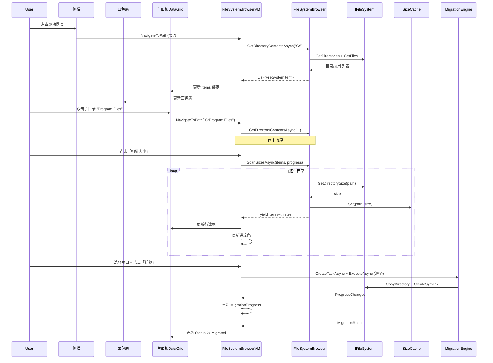

# winC2D Explorer 风格重构 - 架构设计方案

## 1. 概述

将 winC2D 从「固化的 Program Files / AppData 双标签页」重构为**通用文件系统浏览器**，用户可自由浏览任意路径、扫描体积、选择并迁移（符号链接方式）。

### 核心设计决策
- **方案 B**：简化侧栏 + 面包屑导航
- 保留现有迁移引擎（`MigrationEngine`）、文件系统抽象（`IFileSystem`）、大小缓存（`SizeCacheService`）
- 用通用 `FileSystemBrowserView` 替换 `SoftwareMigrationView` 和 `AppDataMigrationView`
- 保留 `SettingsView` 和 `LogView` 不变

---

## 2. UI 布局设计

```
┌──────────────────────────────────────────────────────────┐
│  Title Bar                                                │
├────────────┬─────────────────────────────────────────────┤
│  侧栏      │  面包屑导航栏                                │
│  (200px)   │  [此电脑] > [C:] > [Program Files] > [7-Zip] │
│            ├─────────────────────────────────────────────┤
│ ┌────────┐ │  ┌──────────────────────────────────────┐    │
│ │ 快速访问│ │  │ Name        │ Size    │ Status     │    │
│ │ Program │ │  │ 7z.exe      │ 1.2 MB  │ Normal     │    │
│ │  Files  │ │  │ 7zFM.exe    │ 2.1 MB  │ Normal     │    │
│ │ AppData │ │  │ Lang/       │ 450 KB  │ ...        │    │
│ │ User/   │ │  │ ...         │ ...     │ ...        │    │
│ │ Docs    │ │  │             │         │            │    │
│ └────────┘ │  └──────────────────────────────────────┘    │
│ ┌────────┐ │                                              │
│ │ 此电脑  │ │  选中: 3 项 (3.5 MB)                        │
│ │  C:\    │ │                                              │
│ │  D:\    │ │  目标: [D:\MigratedData     ] [浏览...]     │
│ │  E:\    │ │  [扫描大小]  [迁移选中]                      │
│ └────────┘ │  ████████████░░░░░░░░ 67%                     │
├────────────┴─────────────────────────────────────────────┤
│  Status Bar: Ready                                        │
└──────────────────────────────────────────────────────────┘
```

### 布局说明
- **左侧栏 (200px)**：分两个区域
  - 「快速访问」：固定常用路径（Program Files, AppData, 用户文档等）
  - 「此电脑」：列出所有固定磁盘驱动器
- **面包屑导航栏**：显示当前路径，每级可点击返回
- **主面板**：当前目录的内容列表（DataGrid），支持排序、多选
- **底部操作区**：选中统计、目标路径、操作按钮
- **进度条**：扫描或迁移时显示

---

## 3. 数据模型设计

### 3.1 `FileSystemItem`（新建于 `winC2D.Core/Models/`）

```csharp
// 通用的文件系统条目，替代 SoftwareInfo 和 AppDataInfo
public partial class FileSystemItem : ObservableObject
{
    string   Name;          // 文件/目录名
    string   FullPath;      // 完整路径
    bool     IsDirectory;   // 是否为目录
    bool     IsSelected;    // 是否被选中
    long     SizeBytes;     // 大小（目录为递归计算后的值）
    bool     SizeChecked;   // 大小是否已计算
    bool     IsSymlink;     // 是否为符号链接
    FileSystemItemStatus Status; // Normal/Empty/Migrated/Suspicious/Residual
    
    // 计算属性
    string   SizeText;      // 人类可读的大小字符串
    string   TypeText;      // "文件夹" / "应用程序" / "文件"
}
```

### 3.2 `FileSystemItemStatus`（枚举扩展）

```csharp
public enum FileSystemItemStatus
{
    Normal,       // 正常，可迁移
    Migrated,     // 已迁移（已是符号链接）
    Suspicious,   // 需要用户确认
    Empty,        // 空目录
    Residual,     // 残留（有内容但无意义）
    AccessDenied, // 访问被拒绝
    Error         // 读取错误
}
```

### 3.3 `QuickAccessItem`（新建）

```csharp
public class QuickAccessItem : ObservableObject
{
    string   DisplayName;   // 显示名称（如 "Program Files"）
    string   Path;          // 实际路径
    string   IconGlyph;     // WPF-UI 图标标识
    bool     IsPinned;      // 是否固定
    int      SortOrder;     // 排序序号
}
```

### 3.4 `DriveItem`（新建 - 轻量包装）

```csharp
public class DriveItem : ObservableObject
{
    string   Name;          // "C:"
    string   RootPath;      // "C:\"
    string   Label;         // 卷标（如 "系统盘"）
    long     TotalSize;     // 总容量
    long     FreeSpace;     // 可用空间
    string   DriveType;     // "Fixed" / "Network"
    bool     IsReady;       // 是否就绪
}
```

---

## 4. 服务层设计

### 4.1 `IFileSystemBrowser`（新建于 `winC2D.Core/Services/`）

```csharp
public interface IFileSystemBrowser
{
    // ── 枚举 ──
    Task<IReadOnlyList<FileSystemItem>> GetDirectoryContentsAsync(
        string path, CancellationToken ct = default);
    
    // ── 大小扫描 ──
    /// 流式扫描目录大小，通过 progress 报告进度
    IAsyncEnumerable<FileSystemItem> ScanSizesAsync(
        IReadOnlyList<FileSystemItem> items,
        IProgress<ScanProgressReport>? progress = null,
        CancellationToken ct = default);
    
    /// 重新计算单个条目的大小
    Task<FileSystemItem> RecalculateSizeAsync(
        FileSystemItem item, CancellationToken ct = default);
    
    // ── 驱动器 ──
    Task<IReadOnlyList<DriveItem>> GetDrivesAsync();
    
    // ── 快速访问 ──
    Task<IReadOnlyList<QuickAccessItem>> GetQuickAccessItemsAsync();
    Task AddQuickAccessItemAsync(QuickAccessItem item);
    Task RemoveQuickAccessItemAsync(string path);
    
    // ── 路径验证 ──
    bool IsValidPath(string path);
    bool DirectoryExists(string path);
}
```

### 4.2 `FileSystemBrowser`（新建于 `winC2D.Infrastructure/Services/`）

实现 `IFileSystemBrowser`，依赖现有 `IFileSystem` + `ISizeCacheService`。

关键实现细节：
- `GetDirectoryContentsAsync`：枚举指定目录下的文件和子目录，返回 `FileSystemItem` 列表
- `ScanSizesAsync`：使用 channel 模式（参照现有 `SoftwareScanner`），并发度 4，逐个产出带大小的条目
- 快速访问列表持久化到 `%AppData%/winC2D/quick_access.json`
- 大小缓存复用现有 `ISizeCacheService`

### 4.3 保留的服务（不变）

| 服务 | 变更 |
|------|------|
| `IMigrationEngine` | **不变** - 已支持通用路径迁移 |
| `ISizeCacheService` | **不变** |
| `IFileSystem` | **不变** |
| `ISoftwareScanner` | 保留但不再作为主要 UI 入口，可供快速访问预设使用 |
| `ILocalizationService` | 扩展新的本地化键 |

---

## 5. ViewModel 设计

### 5.1 `FileSystemBrowserViewModel`（新建于 `winC2D.App/ViewModels/`）

```csharp
public partial class FileSystemBrowserViewModel : ObservableObject
{
    // ── 依赖注入 ──
    IFileSystemBrowser, IMigrationEngine, ISizeCacheService,
    ILocalizationService, ILogger, MainViewModel
    
    // ═══════════════════════════════════════════════════
    // 侧栏数据
    // ═══════════════════════════════════════════════════
    ObservableCollection<QuickAccessItem> QuickAccessItems;
    ObservableCollection<DriveItem>       Drives;
    QuickAccessItem? SelectedQuickAccess;    // 当前选中的快速访问项
    DriveItem?       SelectedDrive;          // 当前选中的驱动器
    
    // ═══════════════════════════════════════════════════
    // 面包屑导航
    // ═══════════════════════════════════════════════════
    ObservableCollection<BreadcrumbItem> Breadcrumbs;
    string CurrentPath;                       // 当前完整路径
    
    // ═══════════════════════════════════════════════════
    // 主面板数据
    // ═══════════════════════════════════════════════════
    ObservableCollection<FileSystemItem> Items;        // 当前目录内容
    ObservableCollection<FileSystemItem> SelectedItems;
    string SearchText;
    
    // ═══════════════════════════════════════════════════
    // 操作状态
    // ═══════════════════════════════════════════════════
    bool   IsScanning;
    bool   IsMigrating;
    bool   IsBusy => IsScanning || IsMigrating;
    int    ScanProgress;           // 0-100
    int    MigrationProgress;      // 0-100
    string StatusMessage;
    string CurrentScanDirectory;   // 正在扫描的目录名
    
    // ═══════════════════════════════════════════════════
    // 选中/迁移
    // ═══════════════════════════════════════════════════
    long   TotalSelectedSize;
    int    TotalSelectedCount;
    string TotalSelectedSizeText;
    string TargetPath;
    
    // ═══════════════════════════════════════════════════
    // 命令
    // ═══════════════════════════════════════════════════
    NavigateToPathCommand(path);          // 导航到指定路径
    NavigateToBreadcrumbCommand(index);   // 面包屑导航
    NavigateUpCommand();                  // 向上一级
    RefreshCommand();                     // 刷新当前目录
    ScanSizesCommand();                   // 扫描当前目录项的大小
    SelectAllCommand();
    DeselectAllCommand();
    MigrateCommand();                     // 迁移选中项
    CancelScanCommand();                  // 取消扫描
    BrowseTargetPathCommand();            // 浏览目标路径
    OpenInExplorerCommand(item);          // 在资源管理器中打开
    CopyPathCommand(item);                // 复制路径
    RecalculateSizeCommand(item);         // 重新计算单项大小
    AddToQuickAccessCommand(path);        // 添加到快速访问
    
    // ═══════════════════════════════════════════════════
    // 导航逻辑
    // ═══════════════════════════════════════════════════
    // 双击 DataGrid 中的目录行 → NavigateToPath(childPath)
    // 点击面包屑项 → NavigateToBreadcrumb(index)
    // 点击侧栏驱动器 → NavigateToPath(drive.RootPath)
    // 点击侧栏快速访问 → NavigateToPath(qa.Path)
}
```

### 5.2 `BreadcrumbItem`（新建辅助类）

```csharp
public class BreadcrumbItem
{
    public string DisplayName;  // 显示名称
    public string? FullPath;    // null = 根节点（此电脑）
    public int Index;           // 在面包屑中的位置
}
```

### 5.3 `MainViewModel` 变更

```diff
- NavSoftware  (SoftwareMigrationView)
- NavAppData   (AppDataMigrationView)
+ NavExplorer  (FileSystemBrowserView)  // 新增默认主页
  NavSettings  (SettingsView)           // 保留
  NavLogs      (LogView)                // 保留
  NavAbout     (AboutView)              // 保留
```

---

## 6. View 设计

### 6.1 `FileSystemBrowserView.xaml`（新建）

主要结构：
```xml
<UserControl>
  <Grid>
    <Grid.ColumnDefinitions>
      <ColumnDefinition Width="220"/>  <!-- 侧栏 -->
      <ColumnDefinition Width="Auto"/> <!-- 分割线 -->
      <ColumnDefinition Width="*"/>    <!-- 主内容 -->
    </Grid.ColumnDefinitions>
    
    <!-- 左侧栏 -->
    <Grid Grid.Column="0">
      <Grid.RowDefinitions>
        <RowDefinition Height="Auto"/>   <!-- 快速访问标题 -->
        <RowDefinition Height="Auto"/>   <!-- 快速访问列表 -->
        <RowDefinition Height="Auto"/>   <!-- 分隔 -->
        <RowDefinition Height="Auto"/>   <!-- 此电脑标题 -->
        <RowDefinition Height="*"/>      <!-- 驱动器列表 -->
      </Grid.RowDefinitions>
      
      <!-- 快速访问区域 -->
      <TextBlock Text="快速访问" FontWeight="Bold" .../>
      <ListBox ItemsSource="{Binding QuickAccessItems}" ...>
        <!-- 每项: 图标 + 名称, 点击导航 -->
      </ListBox>
      
      <!-- 此电脑区域 -->
      <Separator/>
      <TextBlock Text="此电脑" FontWeight="Bold" .../>
      <ListBox ItemsSource="{Binding Drives}" ...>
        <!-- 每项: 驱动器图标 + C: (卷标) + 容量条 -->
      </ListBox>
    </Grid>
    
    <GridSplitter Grid.Column="1" Width="4"/>
    
    <!-- 右侧主内容 -->
    <Grid Grid.Column="2">
      <Grid.RowDefinitions>
        <RowDefinition Height="Auto"/>   <!-- 面包屑 -->
        <RowDefinition Height="Auto"/>   <!-- 搜索+工具栏 -->
        <RowDefinition Height="*"/>      <!-- DataGrid -->
        <RowDefinition Height="Auto"/>   <!-- 选中信息 -->
        <RowDefinition Height="Auto"/>   <!-- 目标路径+操作 -->
        <RowDefinition Height="Auto"/>   <!-- 进度条 -->
      </Grid.RowDefinitions>
      
      <!-- 面包屑 -->
      <ItemsControl ItemsSource="{Binding Breadcrumbs}" ...>
        <!-- 渲染: [> 此电脑] [> C:] [> Program Files] -->
      </ItemsControl>
      
      <!-- DataGrid 主面板 -->
      <DataGrid ItemsSource="{Binding Items}" SelectionMode="Extended" ...>
        <CheckBoxColumn Binding="{Binding IsSelected}"/>
        <TemplateColumn Header="Name">
          <!-- 目录 = 文件夹图标 + 名称, 文件 = 文件图标 + 名称 -->
        </TemplateColumn>
        <TextColumn Header="Size" Binding="{Binding SizeText}"/>
        <TextColumn Header="Status" Binding="{Binding Status}"/>
        <TextColumn Header="Type" Binding="{Binding TypeText}"/>
      </DataGrid>
    </Grid>
  </Grid>
</UserControl>
```

### 6.2 `MainWindow.xaml` 变更

```diff
  <ui:NavigationView.MenuItems>
-   <ui:NavigationViewItem NavSoftware → SoftwareMigrationView/>
-   <ui:NavigationViewItem NavAppData  → AppDataMigrationView/>
+   <ui:NavigationViewItem NavExplorer → FileSystemBrowserView/>
    <ui:NavigationViewItem NavSettings → SettingsView/>
    <ui:NavigationViewItem NavLogs     → LogView/>
  </ui:NavigationView.MenuItems>
```

---

## 7. 进度条设计

### 7.1 扫描进度
- **第一阶段（枚举）**：进度条为不确定模式（`IsIndeterminate=true`），显示「正在枚举目录...」
- **第二阶段（计算大小）**：进度条为确定模式（0-100%），显示「正在计算: X/Y 目录名」
- 支持取消按钮（`CancelScanCommand`）

### 7.2 迁移进度
- 基于 `IMigrationEngine.ProgressChanged` 事件
- 批量模式：按总量计算百分比
- 显示「正在迁移: 文件名 (当前MB/总MB)」
- 完成后显示成功/失败摘要

### 7.3 进度条位置
- 在主面板底部、操作按钮下方
- 使用 WPF-UI `ProgressBar` 控件
- 与现有 StatusBar 的 `ProgressRing` 配合使用

---

## 8. 文件变更清单

### 新建文件

| 文件 | 说明 |
|------|------|
| `winC2D.Core/Models/FileSystemItem.cs` | 通用文件系统条目模型 |
| `winC2D.Core/Models/FileSystemItemStatus.cs` | 状态枚举 |
| `winC2D.Core/Models/QuickAccessItem.cs` | 快速访问条目 |
| `winC2D.Core/Models/DriveItem.cs` | 驱动器条目 |
| `winC2D.Core/Services/IFileSystemBrowser.cs` | 浏览器服务接口 |
| `winC2D.Infrastructure/Services/FileSystemBrowser.cs` | 浏览器服务实现 |
| `winC2D.App/ViewModels/FileSystemBrowserViewModel.cs` | 主 ViewModel |
| `winC2D.App/ViewModels/BreadcrumbItem.cs` | 面包屑辅助类 |
| `winC2D.App/Views/FileSystemBrowserView.xaml` | 主界面 XAML |
| `winC2D.App/Views/FileSystemBrowserView.xaml.cs` | Code-behind |

### 修改文件

| 文件 | 变更说明 |
|------|----------|
| `winC2D.App/ViewModels/MainViewModel.cs` | 导航项从 Software/AppData 改为 Explorer |
| `winC2D.App/Views/MainWindow.xaml` | 导航菜单项更新 |
| `winC2D.App/App.xaml.cs` | DI 注册新服务 |
| `winC2D.Infrastructure/ServiceCollectionExtensions.cs` | 注册 `FileSystemBrowser` |
| `winC2D.Infrastructure/Localization/Translations.cs` | 添加新的本地化键 |

### 保留暂不删除

| 文件 | 处理方式 |
|------|----------|
| `SoftwareMigrationView.xaml/.cs` | 保留但不再导航到 |
| `SoftwareMigrationViewModel.cs` | 保留但不再导航到 |
| `AppDataMigrationView.xaml/.cs` | 保留但不再导航到 |
| `AppDataMigrationViewModel.cs` | 保留但不再导航到 |
| `ISoftwareScanner.cs` / `SoftwareScanner.cs` | 保留供内部使用 |

> 旧的 View/ViewModel 可以后续清理，先保留确保回退安全。

---

## 9. 数据流图



---

## 10. 快速访问默认预设

应用首次启动时，自动添加以下快速访问项：

| 显示名称 | 路径 | 图标 |
|----------|------|------|
| Program Files | `%ProgramFiles%` | 文件夹 |
| Program Files (x86) | `%ProgramFiles(x86)%` | 文件夹 |
| AppData (Roaming) | `%AppData%` | 文件夹 |
| AppData (Local) | `%LocalAppData%` | 文件夹 |
| 用户文档 | `%UserProfile%\Documents` | 文件夹 |

用户可以通过右键菜单添加/移除快速访问项（持久化到 JSON）。

---

## 11. 本地化新增键

```
Nav.Explorer           = "文件浏览器"
Explorer.QuickAccess   = "快速访问"
Explorer.ThisPC        = "此电脑"
Explorer.BreadcrumbPC  = "此电脑"
Explorer.ScanSizes     = "扫描大小"
Explorer.Refresh       = "刷新"
Explorer.Search        = "搜索当前目录..."
Explorer.ColName       = "名称"
Explorer.ColSize       = "大小"
Explorer.ColStatus     = "状态"
Explorer.ColType       = "类型"
Explorer.SelectAll     = "全选"
Explorer.DeselectAll   = "取消全选"
Explorer.Migrate       = "迁移选中项"
Explorer.TargetPath    = "目标路径"
Explorer.BrowsePath    = "浏览..."
Explorer.AddToQA       = "添加到快速访问"
Explorer.RemoveFromQA  = "从快速访问移除"
Explorer.OpenExplorer  = "在资源管理器中打开"
Explorer.CopyPath      = "复制路径"
Explorer.Recalculate   = "重新计算大小"
Explorer.TypeFolder    = "文件夹"
Explorer.TypeFile      = "文件"
Explorer.DriveFreeSpace = "{0} 可用 / {1} 总计"

Status.Enumerating     = "正在枚举目录..."
Status.ScanningSizes   = "正在计算大小: {0}/{1} - {2}"
Status.ScanComplete    = "扫描完成: {0} 个项目"
Status.ScanCancelled   = "扫描已取消"
```

---

## 12. 实现顺序建议

1. **模型层**：`FileSystemItem`, `FileSystemItemStatus`, `QuickAccessItem`, `DriveItem`
2. **服务接口**：`IFileSystemBrowser`
3. **服务实现**：`FileSystemBrowser`（含快速访问 JSON 持久化）
4. **DI 注册**：`ServiceCollectionExtensions` + `App.xaml.cs`
5. **ViewModel**：`FileSystemBrowserViewModel` + `BreadcrumbItem`
6. **View**：`FileSystemBrowserView.xaml`
7. **导航重构**：`MainWindow.xaml` + `MainViewModel`
8. **本地化**：添加新键到 `Translations.cs`
9. **测试验证**：端到端流程测试
